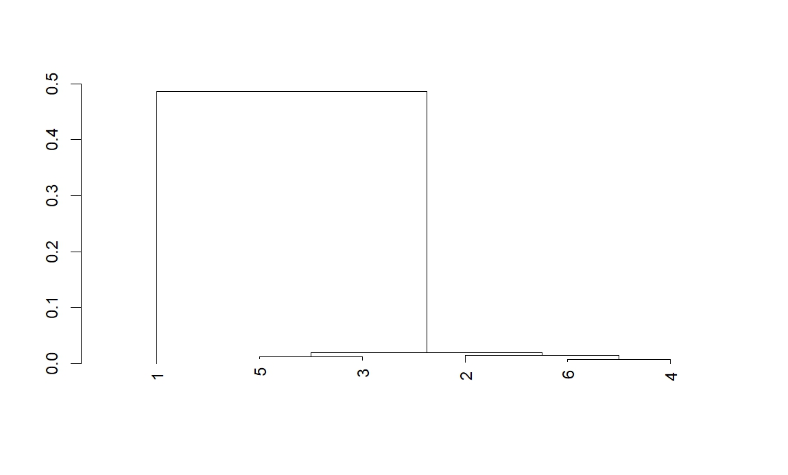

# BIO410-Final-Project
## Background
The data consist of 6 samples from the organism Zaire ebolavirus. This organism is a species known to cause ebola virus disease in humans - and other primates - which is a filovirus causing a severe and often lethal viral haemorrhagic fever (to, 2002).

## Purpose
The purpose of this project was to create a phylogenetic tree from 6 samples of the zaire ebolavirus in order to determine the evolutionary relationship between the organisms. 

## Methods
- We used next generation sequencing to sequence 6 samples of the [Zaire ebolavirus](https://github.com/katejeske22-spec/BIO410-Final-Project/blob/b086803b7e10f1ec42d1e7609e32598812d36b96/Sequences.html.html)
  
- We used [MEGAHIT](https://github.com/voutcn/MEGAHIT) to assemble our sequences

- Ran the following [R script](https://github.com/katejeske22-spec/BIO410-Final-Project/blob/9376bae98446ebfecb0ed061c220b8c1b9242272/Final%20project%20R%20script.R)
  
- We aligned the raw sequence data using the package DECIPHER in Rstudio
  
- Using the DECIPHER package, we used the ML method to create a [phylogenetic tree](https://github.com/katejeske22-spec/BIO410-Final-Project/blob/1f3d8d0e64e95e646b30e013799ae534d03653fd/Phylogenetic%20tree.jpeg) in Rstudio

- The assembled reads are in t(n)_out folders ([t1_out](https://github.com/katejeske22-spec/BIO410-Final-Project/tree/e59c3c9989463db94497f89f90a2a47a667d1169/t1_out), [t2_out](https://github.com/katejeske22-spec/BIO410-Final-Project/tree/6e3b89128ff53e32485dcf2c95927b1296bd41d5/t2_out), [t3_out](https://github.com/katejeske22-spec/BIO410-Final-Project/tree/6e3b89128ff53e32485dcf2c95927b1296bd41d5/t3_out), [t4_out](https://github.com/katejeske22-spec/BIO410-Final-Project/tree/6e3b89128ff53e32485dcf2c95927b1296bd41d5/t4_out), [t5_out](https://github.com/katejeske22-spec/BIO410-Final-Project/tree/6e3b89128ff53e32485dcf2c95927b1296bd41d5/t5_out), [t6_out](https://github.com/katejeske22-spec/BIO410-Final-Project/tree/6e3b89128ff53e32485dcf2c95927b1296bd41d5/t6_out)) and the raw sequencing read are in the folder titled [kate](https://github.com/katejeske22-spec/BIO410-Final-Project/tree/77fd57a62fed0457309e1b0d42debe8063f6a490/kate)

## Results
Here is the phylogenetic tree: (the picture is not uploading - but I did link it in the above section)

Samples 5 and 3 are closest to each other, and 6 and 4 are closest to each other. In general, samples 2-6 are all close to each other while sample 1 is very far from them all. All 6 of these samples seem to have come from one organism at one point before it split where 1 may have continued on the most similar to that ancestor organism, while 2-6 arose after the new organism had a few more changes to the organism that split from the most ancestral organism.

## References
to, C. (2002, June 17). species within the genus Ebolavirus. Wikipedia.Org; Wikimedia Foundation, Inc. https://en.wikipedia.org/wiki/Zaire_ebolavirus
